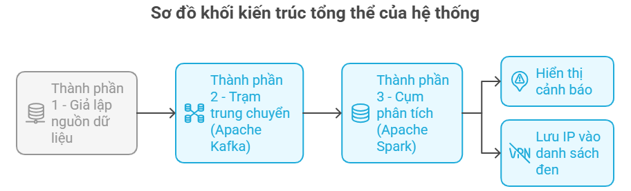

# 🏭 Data Turbine - Hệ Thống SOC & Phân Tích Dữ Liệu Lớn Thời Gian Thực

 [](https://www.python.org/downloads/)
[](https://kafka.apache.org/)
[](https://spark.apache.org/)
[](https://streamlit.io/)
[](https://www.docker.com/)

> **Đồ án môn học:** Xử lý dữ liệu lớn (Big Data)  
> **Sinh viên thực hiện:** Nguyễn Trương Cao Sơn (MSSV: 3123580040)  
> **Giảng viên hướng dẫn:** Vũ Ngọc Thanh Sang  
> **Trường:** Đại học Sài Gòn (Khoa Toán - Ứng Dụng)

---

## 📖 Bối cảnh & Mục tiêu

Trong bối cảnh các hệ thống web liên tục phải đối mặt với các cuộc tấn công DDoS, Brute Force hay Web Scraping, việc phát hiện sự cố bằng các hệ thống lưu trữ truyền thống (Batch Processing) thường gây ra độ trễ lớn, làm mất đi "thời điểm vàng" để ngăn chặn.

Dự án **Data Turbine** được xây dựng nhằm giải quyết bài toán này thông qua kiến trúc **Xử lý Luồng (Stream Processing)**. Hệ thống có nhiệm vụ:
1. **Chịu tải cao:** Tiếp nhận hàng ngàn requests/giây mà không mất mát dữ liệu.
2. **Độ trễ thấp:** Phân tích và phát hiện tấn công trong thời gian tính bằng giây.
3. **Hoạt động đa nhiệm (Dual-purpose):** Cùng một luồng dữ liệu, vừa phát hiện IP độc hại (Security/SOC), vừa bóc tách dữ liệu sạch để phân tích hành vi người dùng (Business Intelligence - BI).

---

## 🏗️ Kiến trúc Hệ thống (Decoupled Architecture)

Hệ thống được thiết kế tách rời hoàn toàn giữa khâu sinh dữ liệu, trung chuyển và phân tích:

1. **Phân hệ 1 (Data Generator):** Kịch bản Python giả lập lưu lượng mạng, trộn lẫn giữa người dùng hợp lệ (70%) và Botnet tấn công (30%) với độ trễ (delay) khác biệt.
2. **Phân hệ 2 (Message Broker - Apache Kafka):** Đóng vai trò là "Hồ chứa" (Reservoir) hấp thụ lưu lượng thô. Sử dụng cơ chế phân vùng (Partitions) để phân phối tải và kiểm soát áp lực ngược (Backpressure).
3. **Phân hệ 3 (Stream Processing - Apache Spark):** Lõi xử lý trực tiếp trên RAM (In-memory). Sử dụng cơ chế **Cửa sổ thời gian (Sliding Window)** và **Micro-batching (3 giây/lô)** để gom nhóm IP, đếm mã lỗi và đối sánh với ngưỡng tĩnh (Threshold) nhằm phát hiện bất thường.
4. **Phân hệ 4 (Data Lake & Dashboard):** Dữ liệu được ghi xuống Data Lake cục bộ (CSV) và trực quan hóa theo thời gian thực (Real-time) bằng giao diện **Streamlit**.

---

## ✨ Các tính năng nổi bật

- 🚨 **Giám sát SOC Thời gian thực:** Phát hiện và cô lập tức thời các IP thực hiện tấn công Brute Force (Mã 401), Dò quét lỗ hổng (Mã 404).
- 🤖 **Phát hiện Web Scraper:** Nhận diện các công cụ cào dữ liệu tự động dựa trên tần suất tải trang bất thường (Mã 200 vượt ngưỡng).
- 📈 **Tái sử dụng Dữ liệu cho BI:** Xây dựng phễu chuyển đổi (Conversion Funnel) và tính toán tỷ lệ mua hàng (CVR) tự động từ luồng log sạch mà không cần truy vấn Database chính.
- 🐳 **Dockerized:** Toàn bộ cụm dịch vụ (Zookeeper, Kafka, Spark Master/Worker) được đóng gói bằng Docker Compose, triển khai chỉ với 1 lệnh duy nhất.

---

## 🚀 Hướng dẫn Cài đặt & Khởi chạy

### Yêu cầu hệ thống
- **Hệ điều hành:** Ubuntu 22.04 LTS (hoặc Windows 11 với WSL2)
- **RAM:** Tối thiểu 16GB (Khuyến nghị để chạy mượt Spark & Kafka)
- **Phần mềm:** Docker Engine (v24.0+) và Docker Compose

### Quy trình 4 bước khởi chạy

**Bước 1: Khởi tạo cụm vi dịch vụ (Infrastructure)**
```bash
docker-compose up -d
```
> Lệnh này sẽ tải ảnh và kích hoạt đồng loạt ZooKeeper, Kafka Broker, Spark Master và Spark Worker.

**Bước 2: Kích hoạt luồng xử lý Spark Streaming**
```bash
docker exec -it spark-master spark-submit /app/processor.py
```
> Gửi tác vụ phân tích thời gian thực (ETL & Rule-matching) vào cụm Spark.

**Bước 3: Khởi chạy máy phát dữ liệu (Producer)** *(Mở một terminal mới)*
```bash
python producer.py
```
> Bắt đầu bơm lưu lượng giả lập (User & Botnet) vào chủ đề `web-logs` của Kafka.

**Bước 4: Vận hành Bảng điều khiển (Dashboard)** *(Mở một terminal mới)*
```bash
streamlit run dashboard.py
```
> Truy cập vào địa chỉ `http://localhost:8501` trên trình duyệt để xem giao diện giám sát thời gian thực.

---

## 📊 Kết quả Thực nghiệm

Trong phiên thử nghiệm tải giả lập cường độ cao (60 giây):
- **Thông lượng trung bình:** 152 requests/giây (Giới hạn thực tế trên single-node có thể đạt ~3,000 req/s).
- **Độ trễ phản ứng (Latency):** ~ 3 giây (Nhờ cơ chế Micro-batch).
- **Tỷ lệ thất thoát dữ liệu (Data Loss):** 0%.
- **Độ chính xác nhận diện:** Chặn thành công 21 IP độc hại, đạt độ nhạy (Recall) 84% và độ đặc hiệu (Precision) 95.4%.
- **Tỷ lệ chuyển đổi mua hàng (CVR):** Đo lường chính xác ở mức 10.38%.

---

## 🚧 Giới hạn & Hướng phát triển

- **Nâng cấp Storage:** Thay thế Data Lake dạng CSV (hiện tại thiếu Schema Evolution) bằng **Apache Parquet** hoặc **ElasticSearch**.
- **Machine Learning:** Thay thế ngưỡng cảnh báo tĩnh (Threshold-based) bằng các mô hình phát hiện bất thường (Isolation Forest / K-Means) từ thư viện **Spark MLlib** để chống lại các đợt tấn công nhịp độ chậm "Low and Slow".
- **Scale-out:** Chuyển đổi từ mô hình Single-node sang Multi-node Cluster để gánh tải mức Enterprise.
- **Đồng bộ State:** Tích hợp Redis làm In-memory DB để đồng bộ danh sách Blacklist thời gian thực giữa cụm xử lý Spark và Dashboard BI.
